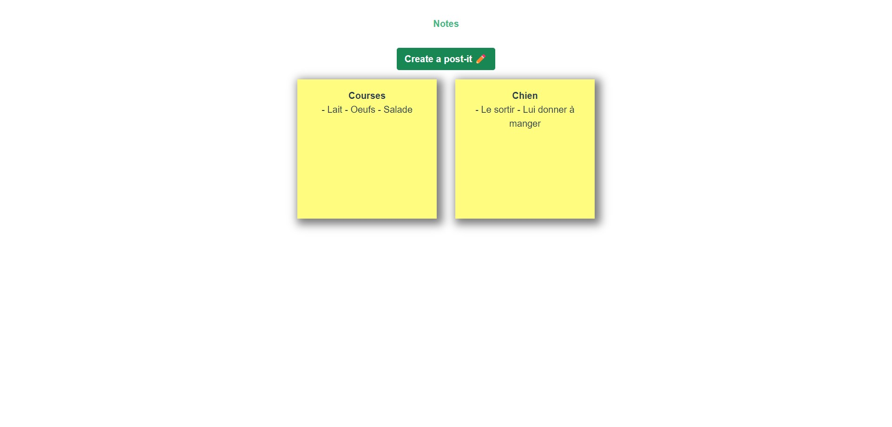
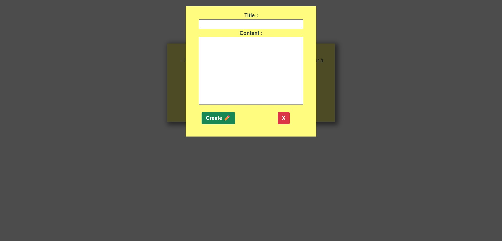
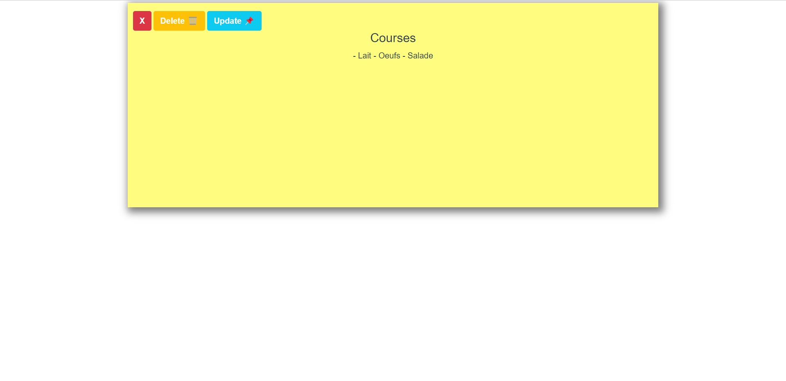
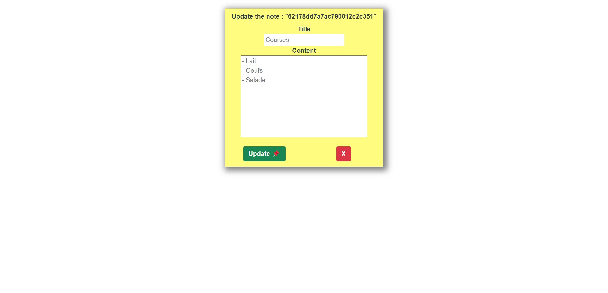

# postit

## Project setup
```
npm install
```

### Compiles and hot-reloads for development
```
npm run serve
```
## Web App Preview

### Home page

Display all the notes created

<p align="center">
  
</p>

### Create page

Form for posting a note 

<p align="center">
  
</p>

### Dynamic page

Display the note clicked in bigger with two options :
- Update this note
- Delete this note

<p align="center">
  
</p>

### Update a note page

Form with actual values in placeholder

<p align="center">
  
</p>
